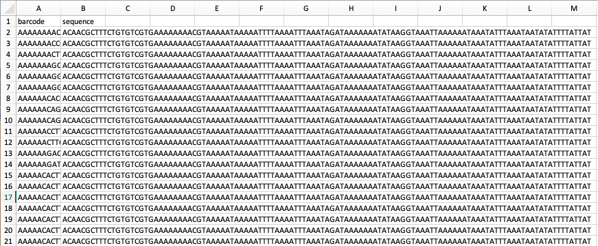

# SOLQC - Synthetic Oligo Library Quality Control (Tool)


This tool allows for an easy to use analysis of synthetic oligo libraries. 

## Contents
* [SOLQC Overview](#overview)
* [Setup](#setup)
* [Preparation (What you need)](#preparation)
* [Usage](#usage)
* [Output](#output)
* [Configuration File](#configuration)
* [Example using the toy data](#example)

## Overview
The solqc is a tool for statistical analysis of synthetic oligo libraries. <br>
Given a list of designed sequences and list of sequenced reads that were generated from the designed sequences the SOLQC tool will output a statistical analysis report of the synthesized sequences.

The tool's pipline is as follows:
1. __Preprocessing__ : Iterate over the sequnced reads of the library and filter out 
reads that do not match certain parameters (prefix, length, etc...)
1. __Matching__ : Matching between the reads and the variants. 
1. __Alignment__ : Aligning each read to his matched variant.
1. __Analysis__ : Analyzing the alignment and matching results.

## Setup
In it's current state we assume the user as some familiarity with python. <br>
You'll need to run the tool with python *3.6.5*.<br>
Start by cloning the repository to a local directory.<br>
Next, open a command line tool, go to the root folder and run:<br>
`pip install -r requirements.txt`
This will install all the necessary modules to run the tool.<br>

## Preparation
In order to use the tool you'll need the following:
* Design, could one of 2 options:
  * A design file, in a csv format containing 2 columns : [barcode, variant]
    * barcode - a sequence identifier for the variant. [Needed for matching between a read and a variant].
    * variant - the complete variant sequence. [Needed for the alignment to analyse missmatches and indel's.
  * IUPAC string
* A reads text file containing all the fasta/q files names of the sequenced read (one row for each file).
* A config.json file containing different possible configuration, see - [configuration](#configuration)

Here is an example for each of those files:
* [design.csv](https://github.com/yoavo1984/SOLQC/blob/master/data/toy_data/design.csv)

  

* [reads.txt](https://github.com/yoavo1984/SOLQC/blob/master/data/toy_data/reads.txt)
```txt
data/my_data/reads_1.fastq
data/my_data/reads_2.fastq
```
* [config.json](https://github.com/yoavo1984/SOLQC/blob/master/data/toy_data/config.json)
```json
{
    "prefix" : "ACAACGCTTTCTGTGTCGTG",
    "suffix" : "",
    "length" : 0,
    "barcode_start" : 20,
    "barcode_end" : 32,
}
```

## Usage
Open a command line and to go the root folder and run:<br>
`python main.py -d <path_to_design>/design.csv -r <path_to_read>/reads.txt -c <path_to_config>/config.json`
Or if you are using IUPAC string instead of a design:<br>
`python main.py -d "IUPAC_string" -r <path_to_read>/reads.txt -c <path_to_config>/config.json`

### Additional Parameters
* __--no-edit__(flag) : If you don't want to prefrom alignemnt between the reads and variants (highly recommended if you don't want to perform any related analysis as it saves a lot of running time. 
* __--edit__(flag) : If you want to prefrom alignemnt [Default]
* __-a__ (str array) : Allows the specification of different matching startegies. Currently only one matching is implemented.
* __-id__ (str): Will prefix outputed files (relevant if you want to run multiples run and not erase old output). 
* More parameters will come soon!

### Analysis Options
We will soon allow the setting of different analysis on the library from the command line but
currently you'll need to go main.py and choose them yourself.<br>
Go to line 139 and choose the the desired analysis. (you can see all of them in the __analyzer.py__ file).
```python
analyzers = AnalyzerFactory.create_analyzers([AnalyzersNames.GENERAL_ANALYZER,
                                                  AnalyzersNames.FREQUENCY_ANALYZER
                                                  ])
```

## Output
Once the tool is done you can find the analysis results under a __deliverable__ folder.
Currently you can get 2 types of results:
* A report containig different kinds of analysis
* A frequency.csv containg 2 columns : [variant_id, variant_count] the variant id specify the row of the variant in the design csv file.


## Configuration
In order to run the tool you must supply a config file to the program. This should be a json file containing the following parameters:<br>
```json
{
    "prefix" : "ACAACGCTTTCTGTGTCGTG",
    "suffix" : "",
    "length" : 0,
    "barcode_start" : 20,
    "barcode_end" : 32,
}
```
* __prefix__ : If supplied will remove all reads not starting with the supplied sequence.
* __suffix__ : If supplied will remove all reads not ending with the supplied sequence.
* __length__ : If supplied and set to a value above 0 will only leave reads with <br>
      length - 5 <= len(read) <= length + 5
* __barcode_start__ : Start position of the barcode.
* __barcode_end__ : End position of the barcode.

## Example
We recommend running the tool with the toy data supplied with this repository.<br>
This will give you a sense of how to use the tool with a relative small sized data, so it will run the entire analysis
in less than 30 seconds.<br>
After you setup the tool simply run :<br>
`-d data/toy_data/design.csv -r data/toy_data/reads.txt -c data/toy_data/config.json`


